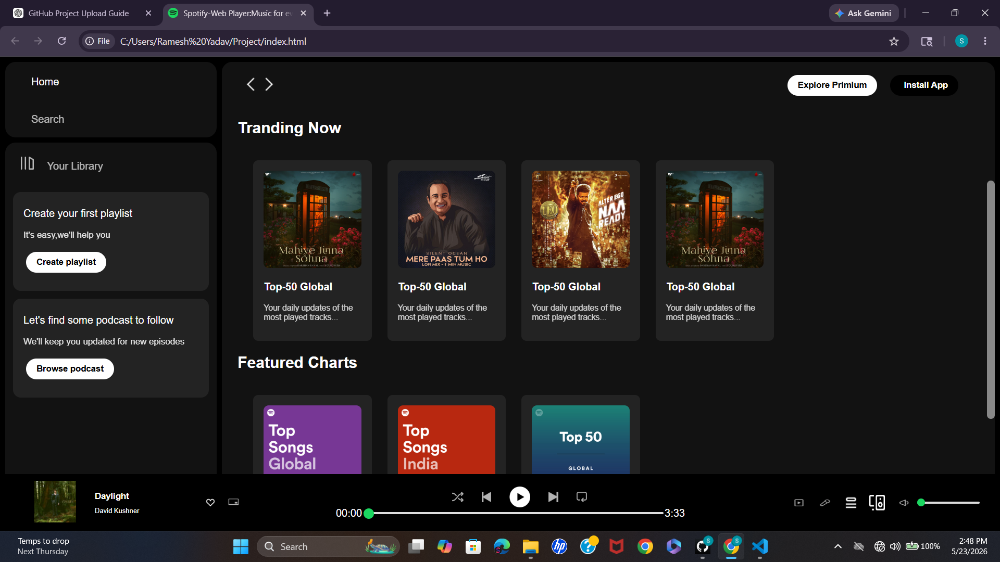

# Spotify Design Clone

A responsive Spotify-inspired music streaming web application featuring a modern user interface, interactive music controls, playlists, and smooth user experience built using HTML and CSS.

---

## 🚀 Features

- 🎵 Spotify Inspired UI Design
- 📱 Fully Responsive Layout
- 🎧 Music Player Controls
- 📂 Sidebar Navigation
- 🖼️ Album & Playlist Cards
- 🔊 Interactive Footer Music Bar
- ✨ Modern Dark Theme Interface

---

## 🛠️ Tech Stack

- HTML5
- CSS3
- Font Awesome

---

## 📂 Project Structure

```bash
spotify_page/
│
├── index.html
├── style.css
├── album_icon1.png
├── album_icon2.png
├── card1img.jpeg
├── card2img.jpeg
├── card3img.jpeg
├── controls_icon1.png
├── controls_icon2.png
├── controls_icon3.png
├── controls_icon4.png
├── controls_icon5.png
└── more assets...
```
## Instalation & Setup
# Clone the repository
git clone https://github.com/Simran092004/spotify_page.git

# Move into project folder
cd spotify_page

# Open index.html in browser

## Screenshots
### HomePage

